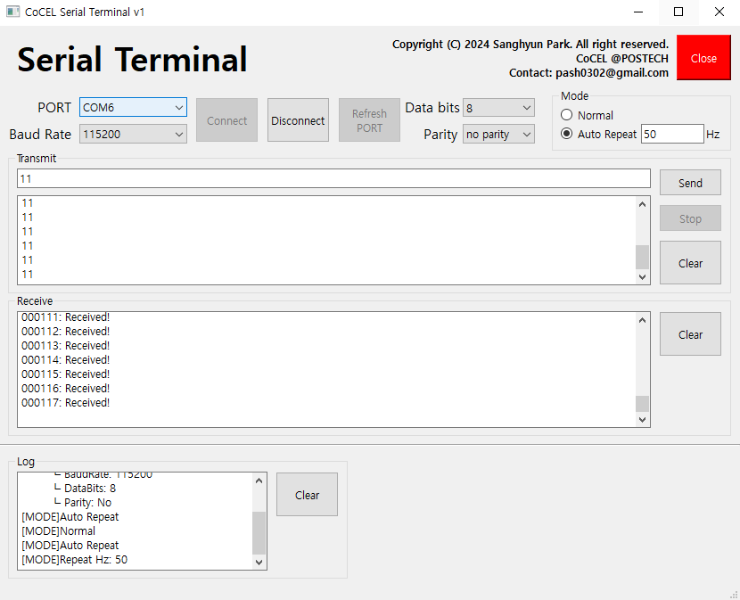

# CoCEL_Serial_Terminal  
This repo is Serial Terminal with **Automatic Signal Generator**.  

## Features
- Includes common Serial Terminal functions.  
- **Generate Signal Automatically.**  

  

## How to Use?
**Step 1**  
- Download this repository.  

**Step 2**  
- Run `CoCEL_Serial_Terminal.exe` in `release` folder.  

## NOTE  
- Unstable Signal Generator.
- This version doesn't support some functions.